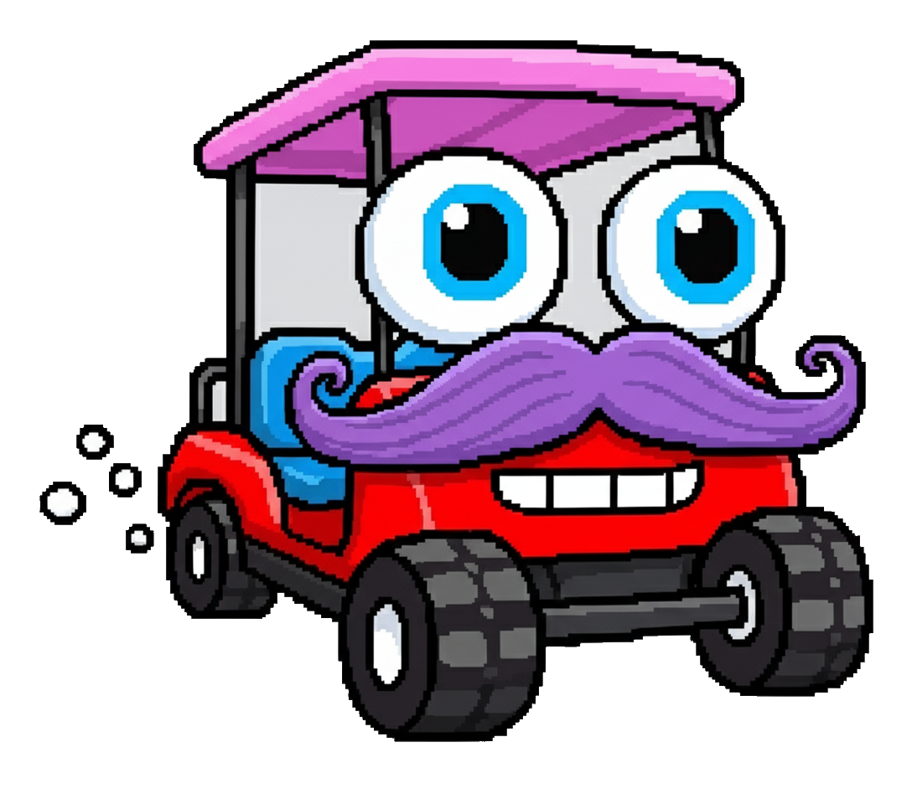

# Zerble at the Festival

> A bubble adventure.

<p align="center">
  
</p>

Drive a smiling, mustachioed golf cart through a procedural festival. Trail bubbles past dancing crowds, drum circles, food trucks, brass bands, and giant puppet parades. Collect smiles. Don't run over the kids.

**▶ Play it live: <https://garyreckard.github.io/zerble-at-the-festival/>**

## Premise

You are Zerble — a glow-eyed festival cart with bubble-blowing breath and the world's biggest mustache. The festival sprawls procedurally in every direction: main stage at the origin, side stages, vendor rows, food plazas, drum circles, hammock groves, lakes, forests, and mountains on the horizon.

The crowd is watching. Glide past them. Let your bubbles drift. They will smile — and smiles fly to you like tiny suns.

## Features

- **An infinite festival.** The world streams in around you as you drive — a procedural generator lays out festival hubs (main stages, food courts, vendor rows, drum circles), roads, lakes, and forests deterministically from the seed, so it feels designed but never runs out.
- **A living crowd.** NPCs have personalities (curiosity, skittishness, social, talkative). They wander, watch, approach, panic, and ride along, while frisbee players wind up and toss to one another and a rare festival photographer stops to frame Zerble and pop a tiny camera flash. Make eye contact and blow bubbles past them, and they smile.
- **Juicy feedback without visual clutter.** Each score increase briefly enlarges the smile count and flashes it warm gold. Boosting at high speed leaves a short sequence of cart-sized golden wake rings behind Zerble, and beating the saved best launches one small confetti celebration per session.
- **A real day/night cycle.** Dawn → noon → dusk → midnight, on a tunable loop. Stage lights and tiki torches kick in after sundown. The sky shifts. The drum circles get louder when the dark settles.
- **Procedural sound.** No audio files. The engine drone, empty-juice sputter, collision thuds, bicycle bell, clown horn, brass band, drum circles, and crackling campfires are all synthesized at runtime in Web Audio.
- **Forests, lakes, mountains.** Drive into the woods and find a clearing with a fire. Drive to the shore and find a canoe. Drive far enough and the hills rise around you in autumn color.
- **Find Lurleen.** Somewhere out there is a second cart with pink puffy lips, raffia hair, and a basket of flowers. She is shy. Get close and the air fills with hearts.
- **Two ways to play.** **Just Cruisin'** is the endless no-pressure sandbox. **Festival Run** asks for your name at the gate and then means it: every festival day the juice gets scarcer, the vendors get pricier, and the marshals get stricter. Chain smiles for multipliers (Lurleen doubles everything while she's smitten), run the tank dry or annoy the wrong people and your run is over — name, score, and days survived on the local Legends board.
- **Don't hit anything.** Puppet parades, brass bands, gaggles of kids, food trucks, craft tents, the stage, lampposts, trees, drum circles, the lake edge. They will dock your smiles.
- **Works on a phone.** Virtual thumbstick, drag-to-orbit camera, honk and boost buttons. Tested in iOS Safari with the URL bar doing its thing.

## Controls

### Keyboard

| Keys | Action |
|---|---|
| `W` `A` `S` `D` | Drive Zerble |
| `← ↑ → ↓` | Orbit / tilt camera |
| `Shift` | Boost |
| `Space` | Honk! (random — bell or clown horn) |
| `B` / `H` | Specific honk — bicycle bell / clown horn |
| `V` | Cycle camera — chase / first-person / top-down |
| `↑` / `↓` (top-down) | Zoom in / out (or mouse wheel) |
| `I` / `O` | Eye glow brighter / dimmer |

### Touch

- Left thumbstick — drive
- Drag anywhere else — orbit / tilt camera
- Boost / Honk / Cam buttons — bottom right

## Play it

Live: <https://garyreckard.github.io/zerble-at-the-festival/> — or open `index.html` in any modern browser. That's it — no install, no build step.

To run a local dev server (recommended, so ES modules load with `file://` blocked):

```
python3 .claude/serve_nocache.py 8765
```

Then visit `http://127.0.0.1:8765`.

## Tech

- Plain ES modules + an importmap. No bundler, no transpiler.
- [three.js](https://threejs.org) for rendering (loaded via CDN through the importmap).
- Web Audio API for everything you hear.
- Vanilla DOM for the HUD.
- ~70 source files, all hand-rolled, all hot-editable.

## Performance tiers

The game sniffs your device at boot and picks a tier — adjusting pixel ratio, shadow quality, post-processing, crowd density, and draw distance to match what it's running on.

## Tips

- Honking makes a ring. NPCs inside the ring snap their heads toward you and a few will smile. Use it.
- Bubbles drift on a slow wandering wind. A long trail of them past a group will rack up more smiles than driving straight through.
- Hold Boost while moving at high speed to see the golden wake rings. They should trail behind the whole cart and never look attached to the Bubble Juice Machine.
- You can knock smiles off your total by ramming people. The crowd panics. Don't.
- If you find Lurleen, drive slow.

## Credits

Built by Gary, with Claude as co-pilot. For every weird, wonderful person who has ever danced near a fire at a festival.

## License

Personal project. License TBD — for now, please ask before redistributing.
